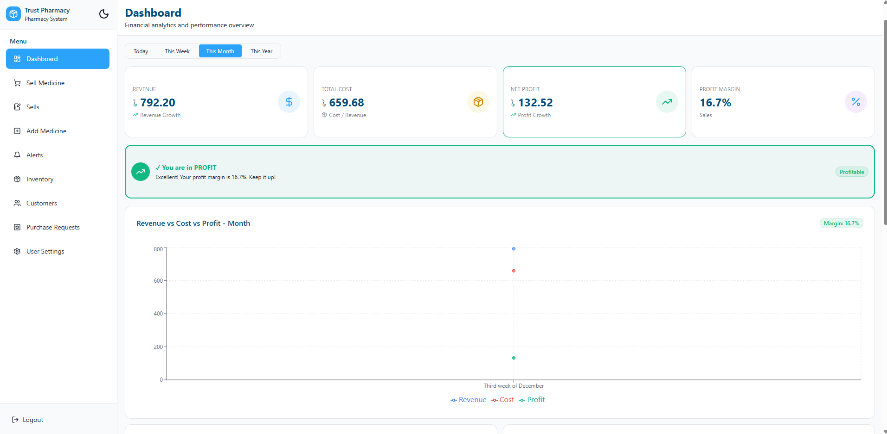
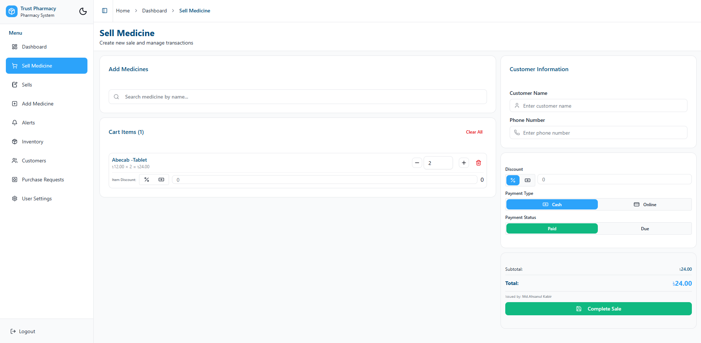
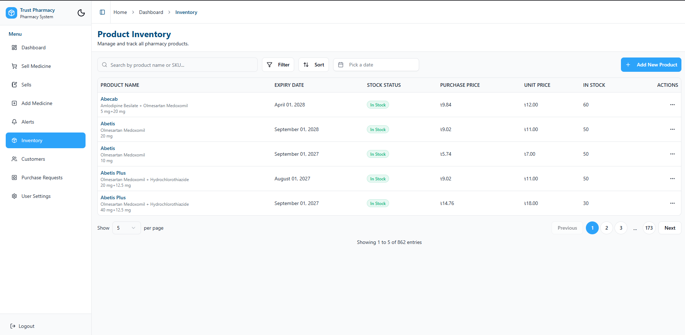
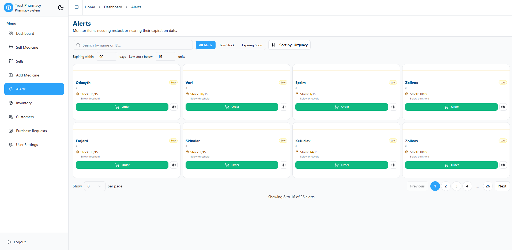
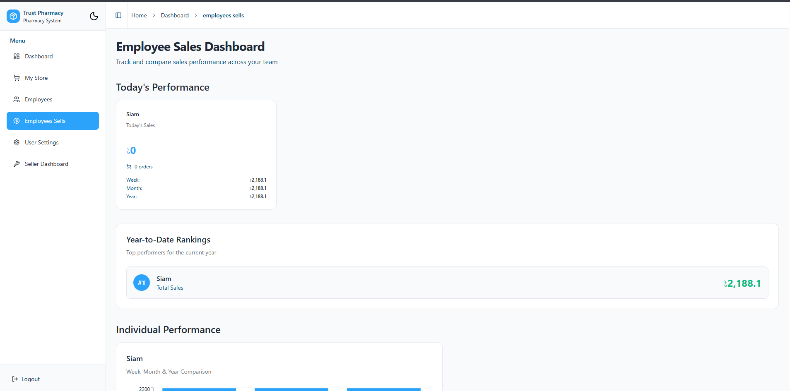
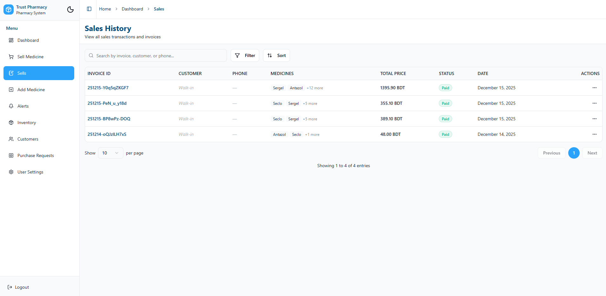
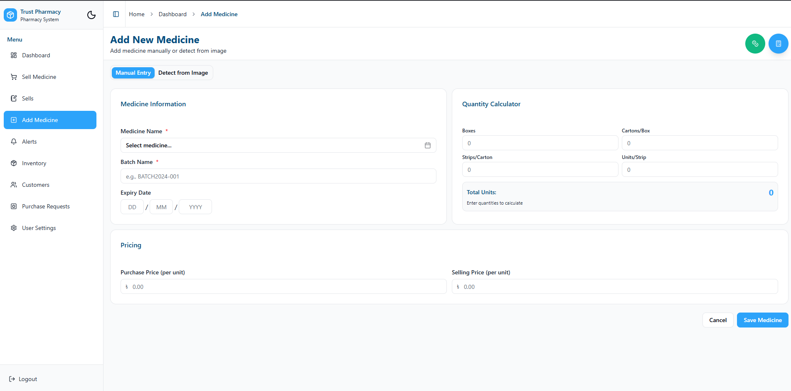

# 🏥 PharmaSaaS - Multitenant Pharmacy Management System

**A modern, scalable, and fully-featured Pharmacy Management Solution built with a Monorepo architecture.**

PharmaSaaS is designed to handle complex pharmacy operations with ease. From high-speed POS transactions to detailed inventory analytics and multitenant support, this system provides everything a pharmacy owner needs to streamline their business.

---

## 🚀 Key Features

### 🏢 Multitenancy & Role Management

- **Multitenant Architecture:** Secure data isolation for different pharmacy branches or distinct pharmacy clients.
- **Role-Based Access Control (RBAC):**
  - **Owner:** View all sales, manage employees, and oversee the specific pharmacy.
  - **Seller/Worker:** Track their own sales and performance.

### 💊 Inventory & Medicine Management

- **Smart Inventory:** Automatic alerts for **Low Stock** and **Low Quantity**.
- **Purchase Planning:** Built-in "To-Buy" list (Todo style) allowing users to add needed medicines and **download as CSV** for suppliers.
- **Medicine Database:** Admins can add global medicines; Sellers can add store-specific stock.

### 🛒 Point of Sale (POS) & Billing

- **Fast Billing:** Optimized for speed.
- **Payment Tracking:** Manage **Due** and **Paid** statuses with customer details.
- **Thermal Printing:** Ready-to-print receipts formatted for **80mm thermal printers**.

### 📊 Analytics & Dashboard

- **Sales Reports:** Visualize sales data Yearly, Monthly, and Weekly.
- **Employee Performance:** Track sales performance per worker.
- **Calendar Integration:** Dashboard calendar for tracking events and settings.

---

## 📸 Screenshots

<table width="100%">
  <tr>
    <td width="50%">
      
       
      
<b>Analytics Dashboard</b>

    </td>
    <td width="50%">
      
       
      
<b>POS & Billing</b>

    </td>
  </tr>
  <tr>
    <td width="50%">
      
       
      
<b>Inventory </b>

    </td>
    <td width="50%">
      
       
      
<b> Stock Alerts </b>

    </td>
  
    
  
  </tr>
  <tr>
    <td width="50%">
      
       
      
<b>Employee sell details</b>

    </td>
    <td width="50%">
      
       
      
<b>Shop Sell</b>

    </td>
  </tr>
  <tr>
    <td width="50%">
      
       
      
<b>Add Medicine To shop</b>

    </td>
  </tr>
</table>

---

## 💎 Pro Version (Premium)

> **Looking for more?** This open-source version is powerful, but our **Premium Version** takes it to the next level.

The Paid version includes:

[**visit link for premium **](https://pharmacy.bitaradigitalit.com/)

---

## 🛠️ Tech Stack

- **Monorepo Tooling:** Turborepo / Nx (depending on your setup)
- **Frontend:** Next.js 16+, React, Tailwind CSS, Shadcn/UI
- **Backend:** NestJS, TypeORM/Mongoose
- **Database:** MongoDB
- **Authentication:** JWT (Access & Refresh Tokens)

---

## ⚙️ Installation & Setup

This project is a Monorepo containing both the `backend` and `frontend`. Follow these steps to get it running locally.

### 1. Prerequisites

- Node.js (v20+)
- MongoDB installed and running locally

### 2. Clone the Repository

3. Install Dependencies
   Run this in the root directory to install dependencies for both frontend and backend.

Bash

npm install

# or

yarn install 4. Environment Configuration
You need to set up environment variables for both the Backend and the Frontend.

Backend (/backend/.env)
Navigate to the backend folder and create a .env file:

MONGODB_URL=mongodb://localhost:27017

# Template for multitenant databases

MONGO_URI_TEMPLATE=mongodb://localhost:27017/{name}

# Security

ACCESS_TOKEN="fafafafafafaf"
REFRESH_TOKEN="fafafafafafaf"

Frontend (/frontend/.env.local)
Navigate to the frontend folder and create a .env.local file:
BASE_URL=http://localhost:4000
NEXT_PUBLIC_API_URL=http://localhost:4000

5. Running the App
   You can run both apps simultaneously from the root if you have a monorepo script setup, or run them in separate terminals.
   cd backend
   npm run start:dev

Terminal 2: Frontend
cd frontend
npm run dev
Visit http://localhost:3000 to view the application.

 Made with ❤️ by <a href="https://github.com/yourusername">Rifat</a> 

